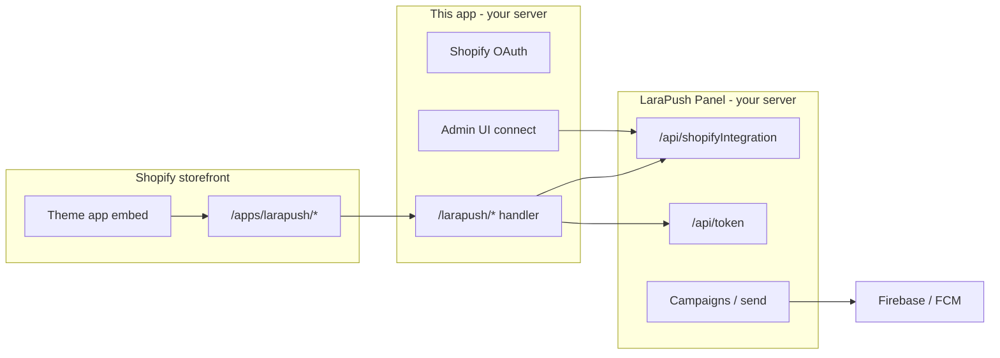

# LaraPush for Shopify (self-hosted)

Self-hosted **custom Shopify app** that connects a merchant store to your **[LaraPush Panel](https://github.com/your-org/Larapush-Panel)** installation. You ship this repository and documentation; each merchant (or agency) hosts the app on their own server and installs it on their store.

Subscribers and push campaigns stay in **LaraPush Panel** — this app only handles OAuth, panel connection, and storefront subscription (popup + service worker via **app proxy**).

## Why app proxy?

Shopify themes cannot upload files to the store root. LaraPush normally needs:

- `firebase-messaging-sw.js` at the site root
- A script that registers web push and posts tokens to the panel

**App proxy** exposes paths on the shop domain that forward to your app:

| Storefront URL | Purpose |
|----------------|---------|
| `/apps/larapush/config.json` | Popup options + Firebase/VAPID config |
| `/apps/larapush/firebase-messaging-sw.js` | Service worker (LaraPush SW v5) |
| `POST /apps/larapush/token` | Subscriber token → forwarded to panel `POST /api/token` |

Visitors see the same LaraPush popup as on WordPress; tokens are stored under the **domain** configured in the panel.

## Architecture



## Prerequisites

1. **LaraPush Panel** deployed and working (domains, Firebase, VAPID configured).
2. **Shopify Partner** account and a custom app (or use CLI to create/link).
3. A **public HTTPS URL** for this app (required for OAuth, webhooks, and app proxy during dev use a tunnel).

Panel must include the Shopify API endpoint (`POST /api/shopifyIntegration`, same email/password auth as WordPress). Deploy the latest `Larapush-Panel` code; no extra Shopify database tables are required.

## Quick start (development)

### 1. Panel

1. Log in to LaraPush Panel.
2. **Domains** → create or open a domain whose **name** matches the store’s primary domain (e.g. `mystore.com`, not `*.myshopify.com`).
3. Open **Integration → Shopify** and note the **domain name** (e.g. `mystore.com`).

### 2. Shopify app

```bash
cd selfhostedapp1
npm install
cp .env.example .env
npx prisma migrate deploy
shopify app config link   # link to your Partner app
npm run dev               # tunnel — required for storefront / app proxy
```

Install on a development store when prompted.

### 3. Connect

1. Shopify Admin → **Apps** → LaraPush → **Settings**.
2. Enter **Panel URL**, **email**, **password** (same as WordPress plugin), and **domain name** from step 1.
3. Click **Connect to LaraPush**.

### 4. Theme embed

1. **Online Store → Themes → Customize**.
2. **App embeds** → enable **LaraPush Subscribe** → Save.

### 5. Deploy app configuration

After changing `shopify.app.toml` (proxy, scopes, extensions):

```bash
shopify app deploy
```

Re-install the app if you changed the app proxy subpath.

### 6. Test subscribe

1. Open the storefront in Chrome (desktop).
2. Accept the LaraPush popup, then allow browser notifications.
3. Panel → domain → confirm new subscriber.
4. Send a test notification from the panel (same as WordPress).

## Production deployment (merchant / agency)

Give merchants:

1. This repository (or a release archive).
2. Their own **Shopify Partner** custom app **or** a shared app with per-merchant install.
3. Panel URL pointing to **their** LaraPush Panel instance.

### Host the app

Typical steps (see [Shopify deployment docs](https://shopify.dev/docs/apps/launch/deployment)):

1. Set environment variables on the host:

   | Variable | Description |
   |----------|-------------|
   | `SHOPIFY_API_KEY` | Partner app Client ID |
   | `SHOPIFY_API_SECRET` | Partner app secret |
   | `SHOPIFY_APP_URL` | Public app URL, e.g. `https://shopify-app.merchant.com` |
   | `SCOPES` | `write_app_proxy` |
   | `NODE_ENV` | `production` |
   | `DATABASE_URL` | Recommended: PostgreSQL/MySQL (not SQLite) if you run multiple instances |

2. Build and run:

   ```bash
   npm ci
   npx prisma migrate deploy
   npm run build
   npm run start
   ```

3. Update Partner app URLs to match `SHOPIFY_APP_URL`.
4. Run `shopify app deploy` from a machine with CLI access to register webhooks, app proxy, and theme extension.

### Database

Default is SQLite (`prisma/schema.prisma`). For production, switch the Prisma datasource to PostgreSQL or MySQL and set `DATABASE_URL`. Only **Shopify session** and **connection settings** are stored — not subscribers.

## Panel API (implemented in Larapush-Panel)

| Endpoint | Auth | Purpose |
|----------|------|---------|
| `POST /api/checkAuth` | `email`, `password` in body | Verify panel login (WordPress-style) |
| `POST /api/shopifyIntegration` | `email`, `password`, `domain` | `options` + `popup_data` for storefront |
| `POST /api/token` | Public | Subscriber ingest (app proxy relays here) |

## Troubleshooting

| Issue | What to check |
|-------|----------------|
| No popup | Theme embed enabled? App connected? Network tab: `config.json` |
| `config.json` 503 | Connect app in Admin; panel reachable |
| `config.json` 404 | `shopify app deploy`; use tunnel (`npm run dev`), not localhost-only for storefront |
| Subscriber missing | LaraPush **domain name** in settings matches panel domain; check `POST /apps/larapush/token` |
| SW 404 | Open `/apps/larapush/firebase-messaging-sw.js` on store domain |
| Auth failed | Use same panel email/password as WordPress plugin |

## Repository layout

| Path | Role |
|------|------|
| `app/routes/app.settings.tsx` | Connect / disconnect panel |
| `app/routes/larapush.$.tsx` | App proxy handler |
| `app/larapush.server.ts` | Panel API client |
| `extensions/larapush-subscribe/` | Theme app embed |
| `prisma/schema.prisma` | Sessions + `ShopSettings` |
| `SHOPIFY_TESTING.md` | Detailed test checklist |

## License

Use and modify per your LaraPush / product license terms.
